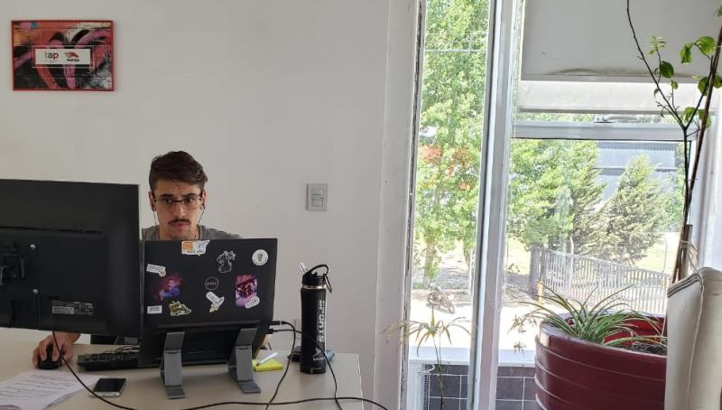

⚡Me entrevistaron 4 estudiantes de la Universidad de Lujan por la materia Gestión de la Innovación.

Charlamos un poco sobre las diferentes formas de Innovar y el camino del emprendedor y el intraemprendedor.

&nbsp;
&nbsp;

Sigo insistiendo:

> La unión e intercambio entre estudiantes y empresas que se animen a contar sobre sus emprendimientos, sus emprendedores, sus éxitos (y a veces más sus fracasos), sirve muchísimo y le aporta a ambas partes una mirada fresca de la realidad.

&nbsp;

Intraemprendedor? Un poco.

[https://iotires.com](https://iotires.com/){:target="_blank"}

[https://micard.io](https://micard.io/){:target="_blank"}

[https://miflotadigital.com](https://miflotadigital.com/){:target="_blank"}

[https://kerdelabs.com](https://kerdelabs.com/){:target="_blank"}

&nbsp;

&nbsp;
&nbsp;

--------
Este post fue publicado originalmente en mi [Linkedin](https://www.linkedin.com/feed/update/urn:li:activity:6733151754856210432/){:target="_blank"}, pero si te gustó: ¡copate y compartilo!

&nbsp;

------------------
📧 Por charlas y talleres: trucchienzo@gmail.com
