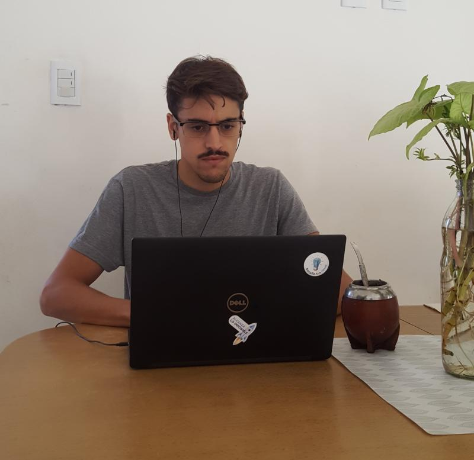

Participé como invitado virtual en la clase "Logística 4.0" en la Tecnicatura en Logística en la [UTN FRVM](https://www.linkedin.com/company/utn-frvm/){:target="_blank"}

Estuvimos charlando con los alumnos y alumnas sobre lo que hacemos en el área de Innovación de [Pedrolga]{:target="_blank"}(https://www.linkedin.com/company/pedrolga/), trabajando en la estrategia tecnológica y cultural, buscando siempre aprender a aprender.

¡Muchas gracias profe Pedro Soldera y UTNpor la invitación!
Creemos que es de mucho valor que en esta etapa de su carrera conozcan, además de la teoría, la realidad de las empresas locales.

&nbsp;

&nbsp;
&nbsp;

--------
Este post fue publicado originalmente en mi [Linkedin](https://www.linkedin.com/feed/update/urn:li:activity:6661611014544510976/){:target="_blank"}, pero si te gustó: ¡copate y compartilo!

&nbsp;
&nbsp;

------------------
📧 Por charlas y talleres: trucchienzo@gmail.com