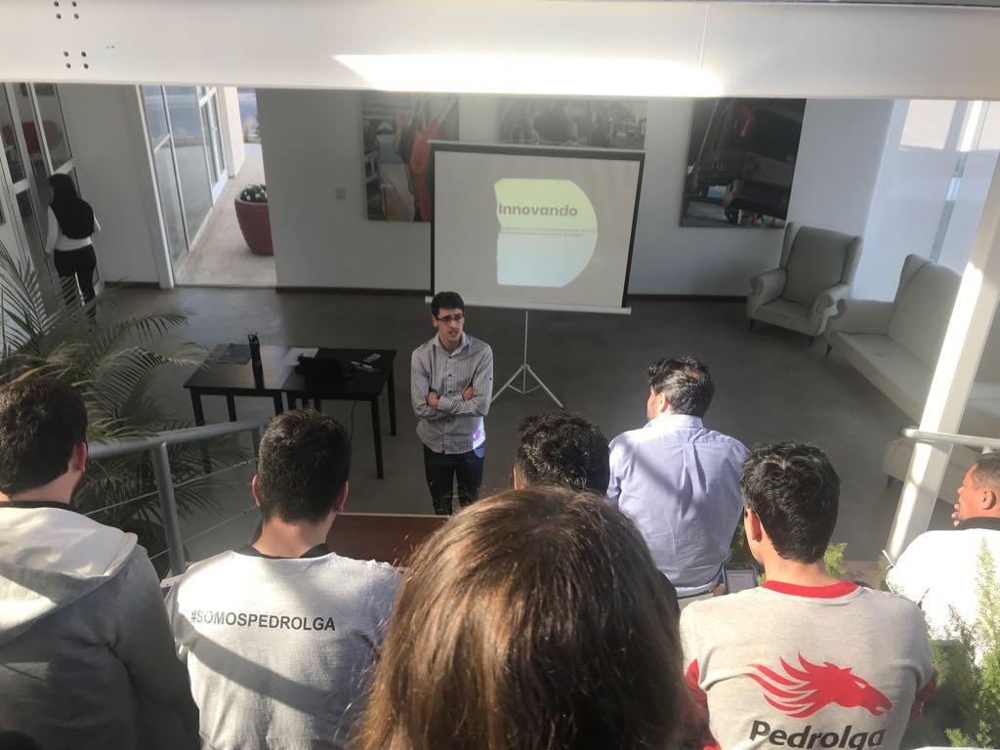

Hace un tiempo me animé a armar y presentar una serie de charlas que iban de la mano de mi rol de Responsable de Innovación en la empresa [Pedrolga](https://pedrolga.com).

Se llamaba 🌞 Vengadores Unidos 🌞 (si, es dificil madurar) y basandome en las diferentes áreas de la empresa en aquel entonces y mezclando personalidades de cada integrante, armamos equipos de trabajo para mejorar cosas como innovación, creatividad, pensamiento fuera de la caja, gestión del tiempo y más.

Mi rol fue el de armar el programa, dar las presentaciones y guíar a los participantes a traves de las actividades.

A veces se trata de animarse a algo superador y confiar en que va a impactar en la vida de la empresa.

&nbsp;
&nbsp;

&nbsp;
&nbsp;

--------
Este post fue publicado originalmente en mi [Linkedin](https://www.linkedin.com/feed/update/urn:li:activity:6709119153967505409/), pero si te gustó: ¡copate y compartilo!

&nbsp;
&nbsp;

