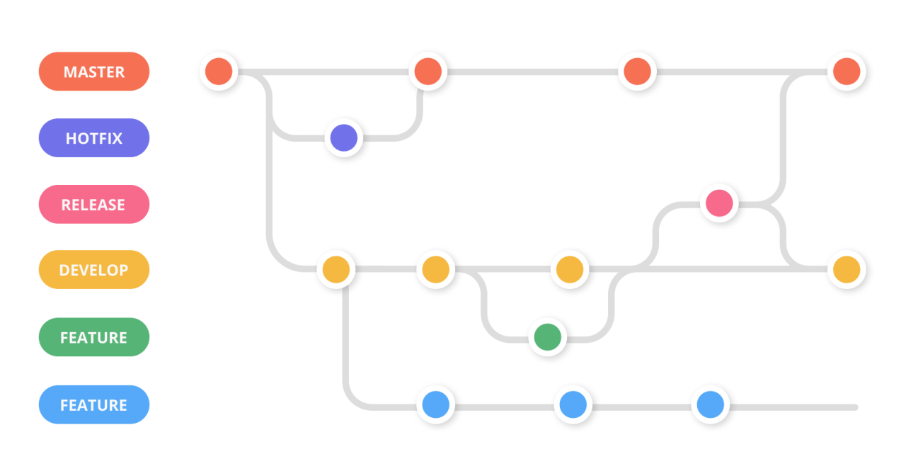

> o un título menos nerd.

Gran must have para nuev@s (y no tan nuev@s) devs:  _Conocimientos en git_. Constantemente me gusta adquirir nuevos conocimientos y voy a tratar de explicarte un posible escenario de un workflow git based (o flujo de trabajo basado en git 😊) de la forma más amena posible: Con una pizzería.

Recordá que workflows git based hay muchísimos y funciones/posibilidades de usar git también. Adaptalo a gusto y necesidad!

&nbsp;
&nbsp;

&nbsp;
&nbsp;

**Lo primero: Setear nuestros escenarios.**

Nosotros vamos a tener:  **Cocina – Barra – Salón**

Lo que podría equivaler a:  **Development – Pre Production – Production**

Vamos a por nuestro primero pedido!

1. Mesa 5 pide 2 muzzas + 3 flanes de huevo de postre.

2. Barra pasa el pedido a la cocina y piensa en el camino:  [“Que bueno sería ir entregando de a partes, minimizaríamos el margen de error y el cliente podría saborear todo”.](https://es.wikipedia.org/wiki/Entrega_continua)

3. Cocina prepara el pedido y lo pasa a la barra. En ese momento se libera y arranca a trabajar en otro pedido, en la única mesa de cocina.

4. Barra revisa la parte del pedido (2 muzzas) y lo desaprueba, porque una de las mazas está más cruda que la otra. Barra devuelve el pedido a cocina y piensa: “[Que bueno sería tener pruebas automáticas antes de el pedido llegue a barra](https://git-scm.com/book/en/v2/Customizing-Git-Git-Hooks)”.

5. Cocina recibe la devolución y ahora tiene un problema: La única mesa de cocina está ocupada en el pedido nuevo. Cocina piensa: “[Que bueno sería duplicar la mesa de trabajo en un momento dado, como sacar una foto, así después podría volver a lo que estaba con orden](https://git-scm.com/book/en/v2/Git-Branching-Branches-in-a-Nutshell)”.

6. Cocina trabaja en la revisión 1 del pedido y lo envía de nuevo a barra.

7. Barra aprueba el pedido y lo envía al salón. Barra piensa: “[Que bueno sería tener un dron que lleve los pedidos de la barra hasta la mesa automáticamente](https://gist.github.com/noelboss/3fe13927025b89757f8fb12e9066f2fa)”

8. Cocina termina postres y envía a barra. De paso, hace sonar una campana para avisarle que quiere  [unir postres a la mesa 5.](https://docs.github.com/en/free-pro-team@latest/github/collaborating-with-issues-and-pull-requests/about-pull-requests)

9. Barra revisa postres y aprueba la unión.

10. Hora de lavar los platos.

Como podes ver, en 10 simples pasos (9 si no lavaste los platos), podes armar un flujo de trabajo lo suficientemente prolijo para no volverte loc@ y tener en cuenta siempre lo más importante:

> Hacerle llegar a los clientes su pedido!

--------
Este post fue publicado originalmente en mi [Linkedin](https://www.linkedin.com/pulse/super-workflow-basado-en-git-y-algo-m%25C3%25A1s-pizzer%25C3%25ADa-way-enzo-trucchi/?trackingId=2SjDwFTVTN6MhyRPmxhTWA%3D%3D), pero si te gustó: ¡copate y compartilo!

&nbsp;
&nbsp;
