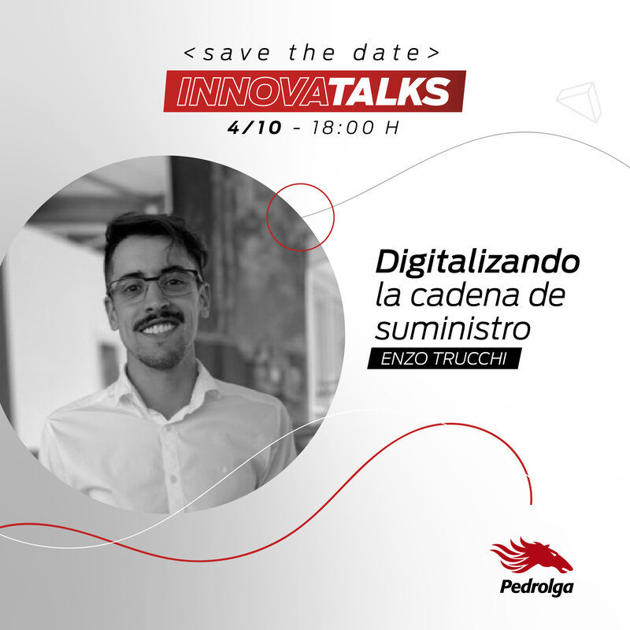

⚡🚀 Lanzamos las InnovaTalks, un nuevo ciclo de Webinars Gratuitos ⚡🚀
Porque lo que se aprende, se comparte y así es como se multiplica.

🕶 Se trata de una serie de charlas orientadas a desarrollar conceptos de Innovación y Tecnología.
Son GRATUITAS y de cupos limitados.

Están dirigidas a:
⚡Estudiantes de carreras orientadas a la Logística.
⚡Estudiantes de carreras orientadas a la Informática.
⚡Directores, Gerentes, CEOs y Mandos Medios de compañías de base tecnológica o dedicadas a la Logística.
⚡Público en general

📲 Agendá: el primer encuentro "Digitalización de la cadena de suministro" está a cargo del líder del departamento de innovación [Enzo Trucchi](https://www.linkedin.com/in/ACoAACMJNHABTcWt8o05NDaZzfE_aHme07rdXYI){:target="_blank"}

El anfitrión será Pedro Soldera, Profesor de Logística III de la UTN.

&nbsp;
&nbsp;

--------
Este post fue publicado originalmente en el[Linkedin](https://www.linkedin.com/feed/update/urn:li:activity:6848639215350099968/) de [Pedrolga](https:pedrolga.com) pero si te gustó: ¡copate y compartilo!

------------------
📧 Para charlas y talleres: trucchienzo@gmail.com
