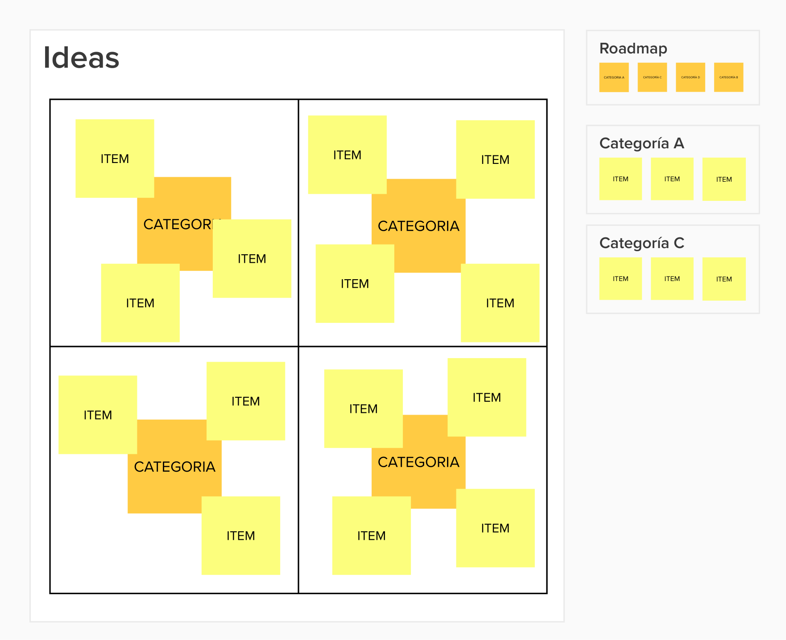

## Organizando tus ideas y tareas con Mural
&nbsp;
&nbsp;

### 🎯 Pro tip muy necesario a la hora de encarar proyectos nuevos y bajar un poco la información:

Si tenés que hacer un desglose de varios temas para alguna actividad, con el objetivo de ordenarlos (en mi caso organizar y bajar a tierra varias ideas que tengo dando vueltas para dar una charla relacionada al [libro que escribí](https://dejunioralinfinito.com.ar){:target="_blank"}, la solución más obvia parece ser una lluvia de ideas con algunos post it o cualquier método de anotación que tengas disponible.
Es una opción válida (y la utilizo bastante en el día a día), pero si buscas algo con más portabilidad y opciones a la hora de compartir, entonces [Mural](https://app.mural.co/){:target="_blank"} entra en acción.

De entrada lo importante: Es una app gratis (con alguna limitación) pero no necesitamos más de lo que ofrece esta versión para empezar a probarla.

## Que necesitaba en este proyecto

En este proyecto necesito algunas cosas muy importantes:
1. Un lugar centralizado al que pueda acceder rápidamente y anotar alguna idea que me venga a la cabeza.
2. Una forma de ordenar y re ordenar las veces que quiera esas ideas (sin tener que despegar y pegar otra vez cada post it).
3. Una herramienta que, de ser necesario, permita imprimir y compartir el tablero.

La opción de [Google Jamboard](https://jamboard.google.com/){:target="_blank"} siempre está presente cuando arranco un proyecto, aunque es dificil utilizarla para proyectos más grandes (más que nada porque no permite tener una hoja/lienzo/espacio de trabajo muy grande, sino que se van agregando hojas nuevas y queda más como un libro).

Entonces vamos con Mural (también podrías probar [Miro](https://miro.com/es/){:target="_blank"}):
&nbsp;
&nbsp;

##  Manos a la obra:

- Lo primero que hice fue dividir en una grilla de 2 x 2 las categorías (sin ningún orden). Fui creando nuevos post it a medida que se me ocurrían.
- Después, cuando cada grilla tuvo bastantes post it, utilicé otra herramienta propuesta por Mural: *Grid Area*. Lo bueno de esta cajita de post it es que nos permite ordenar y re ordenar los post it de manera más sencilla. Entonces, una vez definido el Roadmap de Categorías (muy genérico), empecé a ordenar en cada RoadMap de Categorías los post it.

&nbsp;

&nbsp;
&nbsp;

--------

Si te gustó: ¡copate y compartilo!

&nbsp;
&nbsp;

