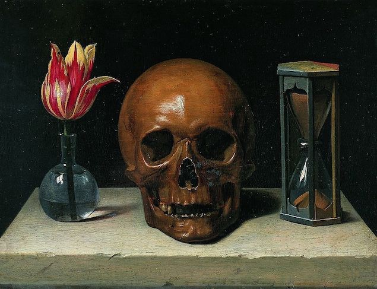

Nuestro paso por el Planeta Tierra es efímero. Puede durar algunos años, poco más, poco menos, pero tiene un fin, y a veces antes de lo previsto. Es una realidad difícil de aceptar pero es así.
Para terminar este libro quiero contarte acerca de esta frase: <strong> Memento Mori </strong> _** -recuerda que morirás-. **_

&nbsp;

Era costumbre hace muchos años, en el desfile victorioso de un general por las calles de Roma, tener tras él un siervo que se encargaba de recordarle las limitaciones de la naturaleza humana, con el fin de impedir que incurriese en la soberbia y pretendiese, a la manera de un dios omnipotente, usar su poder ignorando las limitaciones impuestas por la ley y la costumbre. De esta manera, se intentaba tener a los generales “con los pies sobre la tierra”.

&nbsp;
&nbsp;

Sé muy bien que el comienzo de esta hermosa profesión es agotadora, llena de dudas, con muchas ganas de demostrar que somos valiosos y que podemos hacer cosas geniales, y a veces eso nos termina jugando una mala pasada y el entorno nos termina absorbiendo. Nos volvemos codiciosos en vez de ambiciosos, cerrados en lugar de abiertos, queremos proteger lo nuestro y nos olvidamos de todo y todos los demás. Está en nosotros ser partícipes de nuestra historia y disfrutar el camino.
Esta profesión depende muchísimo de tu estado de ánimo, de tus ganas de hacer, de tus ganas de interactuar con otras
personas. No la concibo de otra forma y el código que hacemos termina siendo resultado de lo bien o lo mal que estemos.

&nbsp;
&nbsp;
&nbsp;
&nbsp;

_**Usá tu Memento Mori, ya sea tu familia, tus mascotas, tus amistades o los pequeños placeres del día a día para recordarte a vos mismo que la vida es corta, y por sobre todo, ¡hay que disfrutarla!**_

&nbsp;

&nbsp;
&nbsp;

--------

Si te gustó: ¡copate y compartilo!

&nbsp;
&nbsp;

