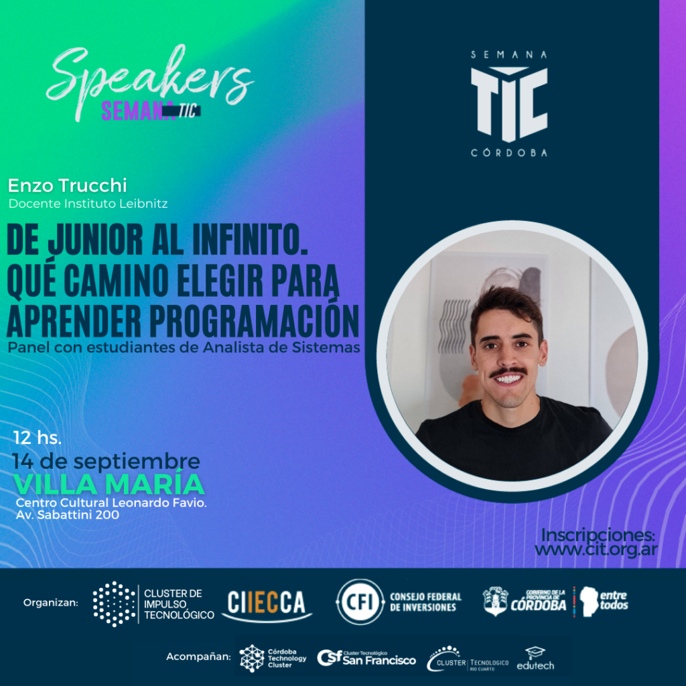

# De Junior al Infinito en la Semana TIC

El 14 de Septiembre estaré presente en la Semana TIC VM, en esta ocasión como speaker y presentando una charla: **De Junior al Infinito**, *que camino elegir para aprender programación*. Un simple aporte entre tantas buenas charlas que se vienen.
&nbsp;
&nbsp;

La idea es contar un poco como es el acceso al mundo desarrollo, que se necesita, que vas a aprender, cual es la dinámica del día a día y algunas cositas más que seguro leíste en el [libro que escribí](https://dejunioralinfinito.com.ar){:target="_blank"}.

&nbsp;
Algo muy importante:
_**No es necesario tener conocimientos previos para asistir a la charla**_.

&nbsp;
¡Te espero!
[Inscribite acá](https://docs.google.com/forms/d/e/1FAIpQLScvxDSwZXPJTDKJPhbkmntXdljB2OS2tffA8KAGj3tsURgaBw/viewform){:target="_blank"}.

&nbsp;

&nbsp;
&nbsp;

--------

Si te gustó: ¡copate y compartilo!

&nbsp;
&nbsp;

